# UI Architecture Diagram - Darter Assistant Authentication Module

## Overview

This diagram presents the complete user interface architecture for the authentication module of the Darter Assistant application, including all new components, modified elements, and data flows between them.

## Mermaid Diagram

```mermaid
flowchart TD
    %% Browser Layer
    subgraph Browser["🌐 Browser"]
        User["👤 User"]
    end

    %% Middleware
    subgraph Middleware["⚙️ Authentication Middleware"]
        MW["middleware/index.ts"]
        MW_Check{"Check<br/>Session"}
        MW_Protected{"Protected<br/>Route?"}
        MW_Auth{"Is<br/>Authenticated?"}
    end

    %% Authentication Pages Layer
    subgraph AuthPages["📄 Authentication Pages - NEW"]
        LoginPage["pages/auth/login.astro"]
        RegisterPage["pages/auth/register.astro"]
        ForgotPage["pages/auth/forgot-password.astro"]
        ResetPage["pages/auth/reset-password.astro"]
        LogoutPage["pages/auth/logout.astro"]
    end

    %% Protected Pages Layer
    subgraph ProtectedPages["🔒 Protected Pages - MODIFIED"]
        MainPage["pages/index.astro<br/>UPDATED"]
    end

    %% Layouts Layer
    subgraph Layouts["🎨 Layouts - MODIFIED"]
        MainLayout["layouts/Layout.astro<br/>UPDATED"]
    end

    %% Navigation Components
    subgraph Navigation["🧭 Navigation - NEW"]
        AuthNav["navigation/AuthNav.tsx<br/>Email + Logout"]
        GuestNav["navigation/GuestNav.tsx<br/>Logo Only"]
    end

    %% Authentication Forms
    subgraph AuthForms["📝 Authentication Forms - NEW"]
        LoginForm["forms/LoginForm.tsx<br/>react-hook-form + Zod"]
        RegisterForm["forms/RegisterForm.tsx<br/>react-hook-form + Zod"]
        ForgotForm["forms/ForgotPasswordForm.tsx<br/>react-hook-form + Zod"]
        ResetForm["forms/ResetPasswordForm.tsx<br/>react-hook-form + Zod"]
    end

    %% Existing Forms
    subgraph ExistingForms["📋 Existing Forms"]
        TournamentForm["forms/AddTournamentForm.tsx<br/>NO CHANGES"]
    end

    %% UI Components
    subgraph UIComponents["🎯 UI Components - shadcn/ui"]
        UIButton["ui/button.tsx"]
        UIInput["ui/input.tsx"]
        UIForm["ui/form.tsx"]
        UILabel["ui/label.tsx"]
        UIToast["ui/sonner.tsx"]
    end

    %% Authentication API Routes
    subgraph AuthAPI["🔌 Authentication API - NEW"]
        API_Register["api/auth/register.ts<br/>POST"]
        API_Login["api/auth/login.ts<br/>POST"]
        API_Logout["api/auth/logout.ts<br/>POST"]
        API_Forgot["api/auth/forgot-password.ts<br/>POST"]
        API_Reset["api/auth/reset-password.ts<br/>POST"]
        API_Session["api/auth/session.ts<br/>GET"]
    end

    %% Existing API
    subgraph ExistingAPI["🔌 Existing API"]
        API_Tournament["api/tournaments/index.ts<br/>NO CHANGES"]
    end

    %% Services Layer
    subgraph Services["⚡ Services - NEW"]
        AuthService["services/auth.service.ts<br/>Business Logic"]
    end

    %% Utilities
    subgraph Utils["🛠️ Utilities - NEW"]
        CookieUtils["utils/cookies.ts<br/>Cookie Management"]
    end

    %% Types
    subgraph Types["📦 Types - MODIFIED"]
        TypesDef["types.ts<br/>UserDTO, SessionDTO<br/>UPDATED"]
    end

    %% Supabase
    subgraph Supabase["☁️ Supabase - MODIFIED"]
        SupabaseClient["db/supabase.client.ts<br/>UPDATED"]
        SupabaseAuth["Supabase Auth"]
        SupabaseDB["Supabase Database<br/>RLS Policies"]
        SupabaseEmail["Supabase Email<br/>Password Reset"]
    end

    %% Cookie Storage
    subgraph CookieStorage["🍪 Storage"]
        Cookies["HTTP-only Cookies<br/>access_token<br/>refresh_token"]
    end

    %% User Flows
    User -->|"1. Visit Page"| MW
    MW --> MW_Check
    MW_Check -->|"Extract Tokens"| Cookies
    MW_Check --> MW_Protected
    
    MW_Protected -->|"Yes"| MW_Auth
    MW_Protected -->|"No"| MainLayout
    
    MW_Auth -->|"Yes"| MainLayout
    MW_Auth -->|"No - Redirect"| LoginPage

    %% Auth Pages to Forms
    LoginPage -->|"Renders"| LoginForm
    RegisterPage -->|"Renders"| RegisterForm
    ForgotPage -->|"Renders"| ForgotForm
    ResetPage -->|"Renders"| ResetForm

    %% Forms Use UI Components
    LoginForm -.->|"Uses"| UIButton
    LoginForm -.->|"Uses"| UIInput
    LoginForm -.->|"Uses"| UIForm
    RegisterForm -.->|"Uses"| UIButton
    RegisterForm -.->|"Uses"| UIInput
    ForgotForm -.->|"Uses"| UIButton
    ResetForm -.->|"Uses"| UIButton

    %% Forms to API
    LoginForm -->|"POST"| API_Login
    RegisterForm -->|"POST"| API_Register
    ForgotForm -->|"POST"| API_Forgot
    ResetForm -->|"POST"| API_Reset
    LogoutPage -->|"POST"| API_Logout

    %% API to Services
    API_Register --> AuthService
    API_Login --> AuthService
    API_Logout --> AuthService
    API_Forgot --> AuthService
    API_Reset --> AuthService
    API_Session --> AuthService

    %% Services to Supabase
    AuthService -->|"signUp()<br/>signIn()<br/>signOut()"| SupabaseAuth
    AuthService -->|"resetPassword()<br/>updateUser()"| SupabaseAuth
    
    %% Supabase Auth
    SupabaseClient --> SupabaseAuth
    SupabaseAuth -->|"Reset Email"| SupabaseEmail
    SupabaseAuth -->|"RLS auth.uid()"| SupabaseDB

    %% API to Cookie Utils
    API_Register --> CookieUtils
    API_Login --> CookieUtils
    API_Logout --> CookieUtils
    
    %% Cookie Utils
    CookieUtils -->|"Set/Clear"| Cookies
    
    %% Middleware Uses Cookie Utils
    MW -->|"Uses"| CookieUtils
    MW -->|"Validates Session"| SupabaseClient

    %% Layout and Navigation
    MainLayout -->|"Authenticated"| AuthNav
    MainLayout -->|"Guest"| GuestNav
    
    %% Protected Pages
    MainLayout -->|"Contains"| MainPage
    MainPage -->|"Renders"| TournamentForm
    
    %% Tournament Form to API
    TournamentForm -->|"POST"| API_Tournament
    API_Tournament -->|"auth.uid()"| SupabaseDB
    
    %% Toast Notifications
    LoginForm -.->|"Success/Error"| UIToast
    RegisterForm -.->|"Success/Error"| UIToast
    TournamentForm -.->|"Success/Error"| UIToast

    %% AuthNav Actions
    AuthNav -->|"Click Logout"| LogoutPage

    %% Types Used Everywhere
    TypesDef -.->|"Used By"| AuthService
    TypesDef -.->|"Used By"| MW
    TypesDef -.->|"Used By"| AuthAPI

    %% Email Flow
    SupabaseEmail -->|"Reset Link"| ResetPage

    %% Styles for New Components
    classDef newComponent fill:#90EE90,stroke:#2d5016,stroke-width:3px,color:#000
    classDef modifiedComponent fill:#FFD700,stroke:#8B7500,stroke-width:3px,color:#000
    classDef existingComponent fill:#E0E0E0,stroke:#666,stroke-width:2px,color:#000
    classDef supabase fill:#3ECF8E,stroke:#2d9168,stroke-width:2px,color:#000
    classDef storage fill:#FFA07A,stroke:#8B4513,stroke-width:2px,color:#000

    %% Apply Styles
    class LoginPage,RegisterPage,ForgotPage,ResetPage,LogoutPage newComponent
    class LoginForm,RegisterForm,ForgotForm,ResetForm newComponent
    class AuthNav,GuestNav newComponent
    class API_Register,API_Login,API_Logout,API_Forgot,API_Reset,API_Session newComponent
    class AuthService,CookieUtils newComponent
    
    class MainPage,MainLayout,MW,TypesDef,SupabaseClient modifiedComponent
    
    class TournamentForm,API_Tournament,UIButton,UIInput,UIForm,UILabel,UIToast existingComponent
    
    class SupabaseAuth,SupabaseDB,SupabaseEmail supabase
    class Cookies storage
```



## Legend

### 🟢 New Components (Green)
Components created from scratch for the authentication module:
- 5 authentication pages
- 4 React forms with validation
- 2 navigation components
- 6 API endpoints
- Authentication service
- Cookie management utilities

### 🟡 Modified Components (Yellow)
Existing components requiring updates:
- Middleware (rewrite from mock auth)
- Layout (add conditional navigation)
- Main page (display form after login)
- Types (add UserDTO, SessionDTO)
- Supabase Client (auth configuration)

### ⚪ Existing Components (Gray)
Components working without changes:
- AddTournamentForm
- Tournament API
- shadcn/ui UI components

### 🟢 Supabase (Green)
- Supabase Auth (user management)
- Supabase Database (RLS policies)
- Supabase Email (password reset)

### 🟠 Storage (Orange)
- HTTP-only Cookies (secure token storage)

## Key Flows

### 1. Registration Flow (US-001)
1. User → `/auth/register`
2. Fills `RegisterForm`
3. POST → `/api/auth/register`
4. `auth.service.ts` → Supabase Auth
5. Set cookies
6. Redirect → `/` (main page)
7. Toast: "Welcome to Darter Assistant!"

### 2. Login Flow (US-002)
1. User → `/auth/login`
2. Fills `LoginForm`
3. POST → `/api/auth/login`
4. `auth.service.ts` → Supabase Auth
5. Set cookies
6. Redirect → `/` (main page)

### 3. Password Reset Flow (US-003)
1. User → `/auth/forgot-password`
2. Fills email in `ForgotPasswordForm`
3. POST → `/api/auth/forgot-password`
4. Supabase sends email
5. User clicks link → `/auth/reset-password?token=xxx`
6. Fills `ResetPasswordForm`
7. POST → `/api/auth/reset-password`
8. Redirect → `/auth/login` with success

### 4. Add Tournament Flow (US-004, US-010)
1. Authenticated user → `/`
2. Middleware validates session
3. Renders `AddTournamentForm`
4. After save → POST `/api/tournaments`
5. RLS checks `auth.uid()`
6. Toast with success + AI feedback

### 5. Logout Flow
1. User clicks "Logout" in `AuthNav`
2. Navigate → `/auth/logout`
3. POST → `/api/auth/logout`
4. Clear cookies
5. Redirect → `/auth/login`

## Security (US-011)

### Middleware Layer
- Check session on every request
- Automatic refresh of expired tokens
- Redirect unauthenticated users to `/auth/login`
- Redirect authenticated users from `/auth/*` to `/`

### API Layer
- Zod validation for all inputs
- HTTP-only cookies (XSS protection)
- SameSite cookies (CSRF protection)
- Short-lived access tokens (1h)
- Refresh tokens (7 days)

### Database Layer
- Row Level Security (RLS) policies
- `auth.uid()` for user data isolation
- User sees only their own tournaments and goals

## State Management

### Server-Side (Preferred)
- **Session**: HTTP-only cookies with tokens
- **User**: `context.locals.user` in middleware
- **Validation**: Supabase Auth getSession()

### Client-Side (Forms)
- **Form State**: react-hook-form
- **Validation**: Zod schemas
- **UI Feedback**: sonner toasts

## Data Types (New in types.ts)

```typescript
UserDTO {
  id: string
  email: string
  created_at: string
}

SessionDTO {
  access_token: string
  refresh_token: string
  expires_at: number
  user: UserDTO
}

RegisterResponseDTO {
  user: UserDTO
  session: SessionDTO
}

LoginResponseDTO {
  user: UserDTO
  session: SessionDTO
}
```

## User Stories Covered

- ✅ **US-001**: Sign Up - New user registration
- ✅ **US-002**: Log In - Existing user login
- ✅ **US-003**: Recover Password - Password reset via email
- ✅ **US-004**: Add Tournament Result - Add tournament (protected)
- ✅ **US-010**: Tournament Data Entry - Save tournament data
- ✅ **US-011**: Secure Access and Authentication - Full authentication

## Files to Create: 19

### Pages (5)
- `src/pages/auth/login.astro`
- `src/pages/auth/register.astro`
- `src/pages/auth/forgot-password.astro`
- `src/pages/auth/reset-password.astro`
- `src/pages/auth/logout.astro`

### Forms (4)
- `src/components/forms/LoginForm.tsx`
- `src/components/forms/RegisterForm.tsx`
- `src/components/forms/ForgotPasswordForm.tsx`
- `src/components/forms/ResetPasswordForm.tsx`

### Navigation (2)
- `src/components/navigation/AuthNav.tsx`
- `src/components/navigation/GuestNav.tsx`

### API Routes (6)
- `src/pages/api/auth/register.ts`
- `src/pages/api/auth/login.ts`
- `src/pages/api/auth/logout.ts`
- `src/pages/api/auth/forgot-password.ts`
- `src/pages/api/auth/reset-password.ts`
- `src/pages/api/auth/session.ts`

### Services and Utilities (2)
- `src/lib/services/auth.service.ts`
- `src/lib/utils/cookies.ts`

## Files to Modify: 5

- `src/middleware/index.ts` - Rewrite to real authentication
- `src/layouts/Layout.astro` - Add conditional header
- `src/pages/index.astro` - Display form after login
- `src/types.ts` - Add authentication types
- `src/db/supabase.client.ts` - Auth configuration

## Files to Remove: 1

- `src/pages/tournaments/new.astro` - Consolidated into index.astro

## Architecture Analysis

### 1. Components to Create (19 new files)

#### Authentication Pages (5):
- `src/pages/auth/login.astro` - Login page
- `src/pages/auth/register.astro` - Registration page
- `src/pages/auth/forgot-password.astro` - Forgot password page
- `src/pages/auth/reset-password.astro` - Reset password page
- `src/pages/auth/logout.astro` - Logout handler

#### React Forms (4):
- `src/components/forms/LoginForm.tsx` - Login form with validation
- `src/components/forms/RegisterForm.tsx` - Registration form with validation
- `src/components/forms/ForgotPasswordForm.tsx` - Forgot password form
- `src/components/forms/ResetPasswordForm.tsx` - Reset password form

#### Navigation Components (2):
- `src/components/navigation/AuthNav.tsx` - Authenticated user navigation
- `src/components/navigation/GuestNav.tsx` - Guest navigation

#### API Routes (6):
- `src/pages/api/auth/register.ts` - Registration endpoint
- `src/pages/api/auth/login.ts` - Login endpoint
- `src/pages/api/auth/logout.ts` - Logout endpoint
- `src/pages/api/auth/forgot-password.ts` - Password reset request endpoint
- `src/pages/api/auth/reset-password.ts` - Password reset endpoint
- `src/pages/api/auth/session.ts` - Session check endpoint

#### Services and Tools (2):
- `src/lib/services/auth.service.ts` - Authentication business logic
- `src/lib/utils/cookies.ts` - Session cookie management

### 2. Components to Modify (5):
- `src/middleware/index.ts` - Rewrite from mock auth to real authentication
- `src/layouts/Layout.astro` - Add conditional header (email + logout)
- `src/pages/index.astro` - Display AddTournamentForm when authenticated
- `src/types.ts` - Add authentication types (UserDTO, SessionDTO)
- `src/db/supabase.client.ts` - Configure auth settings

### 3. Existing Components (used):
- `src/components/forms/AddTournamentForm.tsx` - Main tournament form (no changes)
- `src/db/supabase.client.ts` - Supabase client (requires auth config)
- `src/components/ui/*` - shadcn/ui components (Button, Input, Form, etc.)

### 4. Data Flow:

**Registration:**
Browser → RegisterForm → API /auth/register → Auth Service → Supabase Auth → Cookie Storage → Redirect to Main Page

**Login:**
Browser → LoginForm → API /auth/login → Auth Service → Supabase Auth → Cookie Storage → Redirect to Main Page

**Password Reset:**
Browser → ForgotPasswordForm → API /auth/forgot-password → Supabase Email → ResetPasswordForm → API /auth/reset-password → Redirect to Login

**Protected Route Access:**
Browser → Middleware → Cookie Check → Supabase Session Validation → Set User Context → Render Protected Page

**Logout:**
Browser → Logout Button → API /auth/logout → Clear Cookies → Redirect to Login

### 5. State Management:
- **Session** - HTTP-only cookies (sb-access-token, sb-refresh-token)
- **User in context** - context.locals.user (middleware)
- **Form state** - react-hook-form in each form component
- **Validation** - Zod schemas for each endpoint

### 6. Functional Grouping:
- **Presentation Layer**: Astro pages + React forms
- **API Layer**: API routes under /api/auth
- **Business Logic Layer**: auth.service.ts
- **Data Layer**: Supabase Auth + RLS policies
- **Middleware**: Access control and session management
- **Utilities**: cookies.ts for cookie management

---

*Diagram generated according to auth-spec.md v1.1.0 specification*
