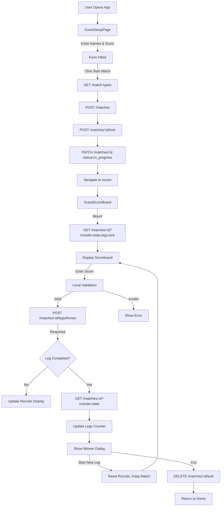

# UI to API Flow Diagrams

## Complete User Journey Flow



---

## Detailed Flow: Match Setup

```
┌─────────────────────────────────────────────────────────────┐
│                      GuestSetupPage                          │
└─────────────────────────────────────────────────────────────┘
                           │
                           │ User fills form:
                           │ - playerName: "John"
                           │ - opponentName: "Jane"
                           │ - startScore: 501
                           │
                           ▼
┌─────────────────────────────────────────────────────────────┐
│              Click "Start Match" Button                      │
└─────────────────────────────────────────────────────────────┘
                           │
                           ▼
                    ┌──────────────┐
                    │ setupMatch() │
                    └──────────────┘
                           │
                           │ Creates MatchSetup object
                           │ {
                           │   playerName: "John",
                           │   opponentName: "Jane",
                           │   startScore: 501,
                           │   limitRounds: null
                           │ }
                           │
                           ▼
                    ┌──────────────┐
                    │ startMatch() │
                    └──────────────┘
                           │
                           ├─────────────────────────────────┐
                           │                                 │
                           ▼                                 ▼
                  API Call #1                       Build Command
          ┌─────────────────────────┐      ┌──────────────────────┐
          │ GET /match-types        │      │ buildCreateMatch     │
          │ ?is_active=true         │      │ Command()            │
          └─────────────────────────┘      └──────────────────────┘
                    │                                │
                    │ Response:                      │ Returns:
                    │ [{                             │ {
                    │   id: "uuid-501",              │   match_type_id: "uuid-501",
                    │   name: "501",                 │   player1: {
                    │   default_start_score: 501     │     guest_name: "John"
                    │ }]                             │   },
                    │                                │   player2: {
                    │                                │     guest_name: "Jane"
                    │                                │   },
                    ▼                                │   start_score: 501,
                  Find 501                           │   checkout_rule: "double_out",
                  Match Type                         │   format_type: "unlimited",
                    │                                │   is_private: false
                    │                                │ }
                    │                                │
                    └────────────────┬───────────────┘
                                     │
                                     ▼
                             API Call #2
                    ┌───────────────────────┐
                    │ POST /matches         │
                    │ Body: CreateMatch     │
                    │ Command               │
                    │ Headers:              │
                    │ X-Session-ID: {uuid}  │
                    └───────────────────────┘
                             │
                             │ Response:
                             │ {
                             │   data: {
                             │     id: "match-123",
                             │     status: "setup",
                             │     player1_guest_name: "John",
                             │     player2_guest_name: "Jane",
                             │     start_score: 501,
                             │     current_leg: 1,
                             │     player1_legs_won: 0,
                             │     player2_legs_won: 0,
                             │     ...
                             │   }
                             │ }
                             │
                             ▼
                     Store Match ID
                localStorage.setItem(
                  "currentMatchId", 
                  "match-123"
                )
                             │
                             ▼
                       API Call #3
              ┌────────────────────────────┐
              │ POST /matches/match-123    │
              │      /lock                 │
              │ Body: {                    │
              │   device_info: {...},      │
              │   auto_extend: true        │
              │ }                          │
              └────────────────────────────┘
                             │
                             │ Response:
                             │ {
                             │   data: {
                             │     match_id: "match-123",
                             │     locked_by_session_id: "session-uuid",
                             │     expires_at: "...",
                             │     auto_extend: true
                             │   }
                             │ }
                             │
                             ▼
                       API Call #4
              ┌────────────────────────────┐
              │ PATCH /matches/match-123   │
              │ Body: {                    │
              │   match_status:            │
              │     "in_progress"          │
              │ }                          │
              └────────────────────────────┘
                             │
                             │ Response:
                             │ {
                             │   data: {
                             │     id: "match-123",
                             │     match_status: "in_progress",
                             │     started_at: "2026-01-28T10:00:00Z"
                             │   }
                             │ }
                             │
                             ▼
              ┌────────────────────────────┐
              │ Update matchState          │
              │ {                          │
              │   matchId: "match-123",    │
              │   matchStatus: "in_progress",│
              │   hasLock: true,           │
              │   ...                      │
              │ }                          │
              └────────────────────────────┘
                             │
                             ▼
              ┌────────────────────────────┐
              │ Navigate to /score         │
              └────────────────────────────┘
```

---

## Detailed Flow: Score Entry

```
┌─────────────────────────────────────────────────────────────┐
│                    GuestScoreBoard                           │
│                   (Active Match View)                        │
└─────────────────────────────────────────────────────────────┘
                           │
                           │ User enters: "60"
                           │
                           ▼
┌─────────────────────────────────────────────────────────────┐
│          Mobile Keyboard / Desktop Keyboard                  │
│  handleNumberInput("6") → currentInput = "6"                │
│  handleNumberInput("0") → currentInput = "60"               │
└─────────────────────────────────────────────────────────────┘
                           │
                           │ User presses Enter
                           │
                           ▼
┌─────────────────────────────────────────────────────────────┐
│                    handleEnter()                             │
└─────────────────────────────────────────────────────────────┘
                           │
                           ▼
                  ┌─────────────────┐
                  │ Parse Input     │
                  │ score = 60      │
                  └─────────────────┘
                           │
                           ▼
                  ┌─────────────────┐
                  │ Get Current     │
                  │ State           │
                  │ - activeRound   │
                  │ - activePlayer  │
                  │ - currentScore  │
                  └─────────────────┘
                           │
                           │ activeRound = Round 1
                           │ activePlayer = "player"
                           │ currentScore = 501
                           │
                           ▼
                  ┌─────────────────┐
                  │ Calculate       │
                  │ newScore =      │
                  │ 501 - 60 = 441  │
                  └─────────────────┘
                           │
                           ▼
              ┌──────────────────────────┐
              │ Local Validation         │
              │ - Valid score? (0-180)   │
              │ - Bust? (< 0 or = 1)     │
              │ - Win? (= 0)             │
              │ - Checkout attempt?      │
              └──────────────────────────┘
                           │
                  ┌────────┼────────┐
                  │        │        │
                  ▼        ▼        ▼
               VALID     BUST      WIN
                  │        │        │
                  │        │        └─────────┐
                  │        │                  │
                  │        │ score = 0        │
                  │        │ remaining =      │
                  │        │ unchanged        │
                  │        │                  │
                  └────────┴──────────┐       │
                                      │       │
                                      ▼       ▼
                      ┌───────────────────────────────┐
                      │ Build CreateThrowCommand      │
                      │ {                             │
                      │   leg_number: 1,              │
                      │   set_number: 1,              │
                      │   player_number: 1,           │
                      │   throw_number: 3,            │
                      │   round_number: 1,            │
                      │   score: 60,                  │
                      │   remaining_score: 441,       │
                      │   is_checkout_attempt: false  │
                      │ }                             │
                      └───────────────────────────────┘
                                      │
                                      ▼
                      ┌───────────────────────────────┐
                      │ OPTIMISTIC UPDATE (Optional)  │
                      │ Update UI immediately         │
                      │ rounds[0].player1Scored = 60  │
                      │ rounds[0].player1ToGo = 441   │
                      └───────────────────────────────┘
                                      │
                                      ▼
                              API Call
                      ┌───────────────────────────────┐
                      │ POST /matches/match-123       │
                      │      /legs/throws             │
                      │ Body: CreateThrowCommand      │
                      │ Headers:                      │
                      │   X-Session-ID: {uuid}        │
                      └───────────────────────────────┘
                                      │
                                      │ Response (201):
                                      │ {
                                      │   data: {
                                      │     id: "throw-456",
                                      │     match_id: "match-123",
                                      │     player_number: 1,
                                      │     score: 60,
                                      │     remaining_score: 441,
                                      │     round_number: 1,
                                      │     ...
                                      │   },
                                      │   meta: {
                                      │     stats_updated: true,
                                      │     match_updated: false,
                                      │     leg_completed: false,
                                      │     match_completed: false
                                      │   }
                                      │ }
                                      │
                                      ▼
                      ┌───────────────────────────────┐
                      │ mapThrowDtoToRoundScore()     │
                      │ Updates rounds array          │
                      └───────────────────────────────┘
                                      │
                                      ▼
                      ┌───────────────────────────────┐
                      │ Update UI State               │
                      │ - Confirm rounds update       │
                      │ - Move to next player         │
                      │ - Clear currentInput          │
                      └───────────────────────────────┘
                                      │
                                      ▼
                      ┌───────────────────────────────┐
                      │ Active player switches        │
                      │ from "player" to "opponent"   │
                      └───────────────────────────────┘
```

---

## Detailed Flow: Leg Completion

```
┌─────────────────────────────────────────────────────────────┐
│              User Enters Winning Score                       │
│     Current: 40, Enter: 40, Remaining: 0                    │
└─────────────────────────────────────────────────────────────┘
                           │
                           ▼
                  ┌─────────────────┐
                  │ handleEnter()   │
                  │ Detects win     │
                  │ (newScore === 0)│
                  └─────────────────┘
                           │
                           ▼
              ┌────────────────────────────┐
              │ Build CreateThrowCommand   │
              │ {                          │
              │   score: 40,               │
              │   remaining_score: 0,      │
              │   is_checkout_attempt: true│
              │   ...                      │
              │ }                          │
              └────────────────────────────┘
                           │
                           ▼
                      API Call
              ┌────────────────────────────┐
              │ POST /matches/match-123    │
              │      /legs/throws          │
              │ Body: CreateThrowCommand   │
              └────────────────────────────┘
                           │
                           │ Response:
                           │ {
                           │   data: {
                           │     score: 40,
                           │     remaining_score: 0,
                           │     winner_player_number: 1,
                           │     winning_checkout: 40
                           │   },
                           │   meta: {
                           │     stats_updated: true,
                           │     match_updated: true,
                           │     leg_completed: true,      ◄── TRUE!
                           │     match_completed: false
                           │   }
                           │ }
                           │
                           ▼
              ┌────────────────────────────┐
              │ Check meta.leg_completed   │
              └────────────────────────────┘
                           │
                           │ TRUE
                           │
                           ▼
                      API Call
              ┌────────────────────────────┐
              │ GET /matches/match-123     │
              │     ?include=stats         │
              └────────────────────────────┘
                           │
                           │ Response:
                           │ {
                           │   data: {
                           │     id: "match-123",
                           │     player1_legs_won: 1,    ◄── INCREMENTED!
                           │     player2_legs_won: 0,
                           │     current_leg: 2,         ◄── NEXT LEG
                           │     match_status: "in_progress",
                           │     stats: [
                           │       { player_number: 1, average_score: 75.5, ... },
                           │       { player_number: 2, average_score: 68.2, ... }
                           │     ]
                           │   }
                           │ }
                           │
                           ▼
              ┌────────────────────────────┐
              │ Update UI State            │
              │ - playerLegs = 1           │
              │ - opponentLegs = 0         │
              │ - legFinished = true       │
              │ - winner = "player"        │
              │ - currentLeg = 2           │
              └────────────────────────────┘
                           │
                           ▼
              ┌────────────────────────────┐
              │ Show Winner Dialog         │
              │ "John wins!"               │
              │ - Checkout darts input     │
              │ - Start New Leg button     │
              └────────────────────────────┘
                           │
                           │ User clicks
                           │ "Start New Leg"
                           │
                           ▼
              ┌────────────────────────────┐
              │ startNewLeg()              │
              │ - Reset rounds array       │
              │ - Reset activeRoundIndex   │
              │ - Set activePlayer         │
              │ - legFinished = false      │
              │ - Keep same matchId        │
              └────────────────────────────┘
                           │
                           │ Next throw will use:
                           │ leg_number: 2 (currentLeg)
                           │
                           ▼
              ┌────────────────────────────┐
              │ Back to Scoring            │
              │ (Same match continues)     │
              └────────────────────────────┘
```

---

## State Flow Diagram

```
┌────────────────────────────────────────────────────────────────┐
│                         UI STATE                               │
│                                                                │
│  ┌──────────────────┐         ┌──────────────────┐           │
│  │ Setup Form       │         │ Match State      │           │
│  │ (Local)          │         │ (From API)       │           │
│  │                  │         │                  │           │
│  │ playerName       │────┐    │ matchId          │           │
│  │ opponentName     │    │    │ playerName       │           │
│  │ startScore       │    │    │ opponentName     │           │
│  │ limitRounds      │    │    │ startScore       │           │
│  └──────────────────┘    │    │ rounds[]         │           │
│                          │    │ playerLegs       │           │
│                          │    │ opponentLegs     │           │
│                          │    │ matchStatus      │           │
│                          │    │ hasLock          │           │
│                          │    └──────────────────┘           │
│                          │                                    │
└──────────────────────────┼────────────────────────────────────┘
                           │
                           │ setupMatch()
                           │ startMatch()
                           │
                           ▼
┌────────────────────────────────────────────────────────────────┐
│                      API SERVICE                               │
│                                                                │
│  createMatch() ──────────► POST /matches                      │
│  acquireLock() ──────────► POST /matches/:id/lock             │
│  updateMatch() ──────────► PATCH /matches/:id                 │
│  recordThrow() ──────────► POST /matches/:id/legs/throws      │
│  getMatch() ─────────────► GET /matches/:id                   │
│  releaseL() ─────────────► DELETE /matches/:id/lock         │
│                                                                │
└────────────────────────────────────────────────────────────────┘
                           │
                           ▼
┌────────────────────────────────────────────────────────────────┐
│                   DATABASE (Supabase)                          │
│                                                                │
│  topdarter.matches                                            │
│  ├─ id, player1_guest_name, start_score                       │
│  ├─ player1_legs_won, player2_legs_won                        │
│  └─ match_status, current_leg, ...                            │
│                                                                │
│  topdarter.match_legs                                         │
│  ├─ match_id, leg_number, player_number                       │
│  ├─ score, remaining_score, round_number                      │
│  └─ winner_player_number, winning_checkout                    │
│                                                                │
│  topdarter.match_stats                                        │
│  ├─ match_id, player_number                                   │
│  ├─ total_score, average_score                                │
│  └─ checkout_attempts, successful_checkouts                   │
│                                                                │
│  topdarter.match_locks                                        │
│  ├─ match_id (PK), locked_by_session_id                       │
│  └─ expires_at, auto_extend                                   │
│                                                                │
└────────────────────────────────────────────────────────────────┘
```

---

## Data Transformation Pipeline

```
┌─────────────────────────────────────────────────────────────────┐
│                     USER INPUT                                  │
│  playerName: "John"                                             │
│  opponentName: "Jane"                                           │
│  startScore: 501                                                │
└─────────────────────────────────────────────────────────────────┘
                              │
                              ▼
┌─────────────────────────────────────────────────────────────────┐
│                  MatchSetup (UI Model)                          │
│  {                                                              │
│    playerName: "John",                                          │
│    opponentName: "Jane",                                        │
│    startScore: 501,                                             │
│    limitRounds: null                                            │
│  }                                                              │
└─────────────────────────────────────────────────────────────────┘
                              │
                              ▼ buildCreateMatchCommand()
┌─────────────────────────────────────────────────────────────────┐
│              CreateMatchCommand (API Command)                   │
│  {                                                              │
│    match_type_id: "uuid-501",                                   │
│    player1: { guest_name: "John" },                             │
│    player2: { guest_name: "Jane" },                             │
│    start_score: 501,                                            │
│    checkout_rule: "double_out",                                 │
│    format_type: "unlimited",                                    │
│    legs_count: null,                                            │
│    is_private: false                                            │
│  }                                                              │
└─────────────────────────────────────────────────────────────────┘
                              │
                              ▼ POST /matches
┌─────────────────────────────────────────────────────────────────┐
│             StandaloneMatchDTO (API Response)                   │
│  {                                                              │
│    id: "match-123",                                             │
│    match_type_id: "uuid-501",                                   │
│    player1_user_id: null,                                       │
│    player1_guest_name: "John",                                  │
│    player2_user_id: null,                                       │
│    player2_guest_name: "Jane",                                  │
│    start_score: 501,                                            │
│    current_leg: 1,                                              │
│    player1_legs_won: 0,                                         │
│    player2_legs_won: 0,                                         │
│    match_status: "setup",                                       │
│    ...                                                          │
│  }                                                              │
└─────────────────────────────────────────────────────────────────┘
                              │
                              ▼ mapMatchDtoToState()
┌─────────────────────────────────────────────────────────────────┐
│              MatchState (UI State)                              │
│  {                                                              │
│    matchId: "match-123",                                        │
│    playerName: "John",                                          │
│    opponentName: "Jane",                                        │
│    startScore: 501,                                             │
│    playerLegs: 0,                                               │
│    opponentLegs: 0,                                             │
│    matchStatus: "setup",                                        │
│    rounds: [...],                                               │
│    ...                                                          │
│  }                                                              │
└─────────────────────────────────────────────────────────────────┘
```

---

## Summary: View-to-API Mapping Table

| UI Component | User Action | Hook Method | API Endpoint | Result |
|--------------|-------------|-------------|--------------|--------|
| **GuestSetupPage** | Fill form | - | - | Local state |
| GuestSetupPage | Click "Start" | `startMatch()` | POST /matches<br>POST /lock<br>PATCH /matches/:id | Match created |
| **GuestScoreBoard** | Page mount | `loadMatch()` | GET /matches/:id | State loaded |
| GuestScoreBoard | Enter "60" | `handleNumberInput()` | - | Local buffer |
| GuestScoreBoard | Press Enter | `handleEnter()` | POST /legs/throws | Throw recorded |
| GuestScoreBoard | Win leg | `handleEnter()` | POST /legs/throws<br>GET /matches/:id | Leg completed |
| GuestScoreBoard | New leg | `startNewLeg()` | - | State reset |
| GuestScoreBoard | Click exit | `exitMatch()` | DELETE /lock | Lock released |
| **GuestScoreHomePage** | Same as GuestScoreBoard | Same | Same | Same |

All flows are now completely mapped from UI interactions to API calls!

